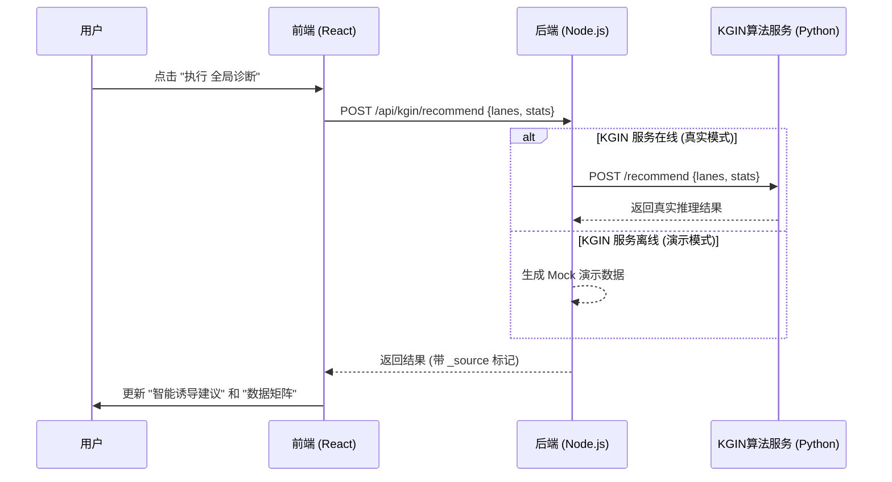

# KGIN 算法接入总纲 (KGIN Integration Guidelines)

本文档旨在指导如何将 KGIN (Knowledge Graph Inductive Network) 算法工程接入到 Smart Traffic Digital Twin 平台。

## 1. 架构概述

平台采用 **服务化架构** 进行算法接入。目前 Dashboard 后端已经实现了自动回退机制：当 KGIN 服务未启动时，使用内置的 Mock 数据进行“PPT 演示”；当 KGIN 服务启动后，自动切换到真实算法推理。



## 2. 接口定义

请在您的 KGIN 算法工程中实现以下 HTTP 接口：

### 2.1 推荐接口 (Recommend Endpoint)

*   **URL**: `POST /recommend`
*   **Content-Type**: `application/json`

#### 请求体 (Request Body)

后端会将当前的实时交通状态发送给算法服务：

```json
{
  "lanes": [
    {
      "id": "L-01",
      "traffic": 428,      // 当前流量 (veh/h)
      "speed": 72.4,       // 当前速度 (km/h)
      "queue": 0.0,        // 排队长度 (m)
      "occupancy": 12,     // 空间占有率 (%)
      "status": "normal"   // 状态 (normal, congestion, etc.)
    },
    // ... 其他车道数据
  ],
  "stats": {
    "globalDensity": 32.4,
    "efficiency": 94.2,
    "load": 24,
    "latency": 8,
    "timestamp": "14:22:05:88"
  }
}
```

#### 响应体 (Response Body)

算法服务需要返回以下格式的 JSON 数据：

```json
{
  "summary": "当前路网整体运行平稳，但 L-03 节点出现轻微拥堵预兆。", // (String) 简短综述
  "recommendations": [ // (Array<String>) 文本建议列表，用于显示在“智能诱导建议”窗口
    "建议在 L-03 上游 500m 处开启分流诱导",
    "建议将 L-04 限速调整为 60km/h",
    "建议重点监控 L-02 的汇入车流"
  ],
  "optimizedParams": [ // (Array<Object>) 针对每个车道的具体量化建议，用于显示在“数据矩阵”下半部分
    {
      "laneId": "L-01",         // 对应车道 ID
      "suggestedTraffic": 400,  // 建议流量 (veh/h)
      "suggestedSpeed": 70,     // 建议限速 (km/h)
      "expectedQueue": 0,       // 预期排队长度 (m)
      "optimizationRate": 0.05  // 预计优化率 (0.05 代表提升 5%)
    },
    {
      "laneId": "L-03",
      "suggestedTraffic": 450,
      "suggestedSpeed": 50,
      "expectedQueue": 5.0,
      "optimizationRate": 0.12
    }
    // ... 覆盖所有车道
  ],
  "timestamp": "2023-10-27T10:00:00Z" // 可选
}
```

## 3. KGIN 工程侧需要做的事情 (待办清单)

为了让“PPT模式”转变为“真实业务模式”，算法工程师需要在 KGIN 工程中完成以下工作：

1.  **实现 HTTP 服务层**:
    *   使用 FastAPI 或 Flask 包装原有的 KGIN 模型。
    *   监听端口推荐为 **8000** (与 Dashboard 默认配置一致)。

2.  **实现数据映射逻辑 (Mapping)**:
    *   Dashboard 传来的 `laneId` (如 "L-01") 需要映射到 KGIN 模型中的 `User ID` (Traffic Condition Node)。
    *   需要设计一个映射表或哈希函数，将实时交通状态转换为图模型可理解的输入节点。

3.  **实现推理逻辑 (Inference)**:
    *   接收输入节点后，运行 KGIN 的 `rating` 或 `predict` 函数。
    *   获取 Top-K 推荐结果 (Items/Strategies)。

4.  **实现结果反向映射 (Reverse Mapping)**:
    *   将模型输出的 `Item ID` (策略 ID) 转换为人类可读的文本建议 (如 "开启分流")。
    *   根据模型预测的优化评分，计算具体的 `suggestedTraffic` 和 `suggestedSpeed` 数值。

## 4. 联调验证

当 KGIN 服务启动并监听 8000 端口后，Dashboard 后端会自动检测到连接，并停止发送 Mock 数据，转而转发真实的推理结果。

您可以通过查看 Dashboard 后端的控制台日志来确认连接状态：
*   成功: `[KGIN] Service response received successfully.`
*   失败 (自动降级): `[KGIN] Service unavailable, switching to Mock/Fallback mode`
